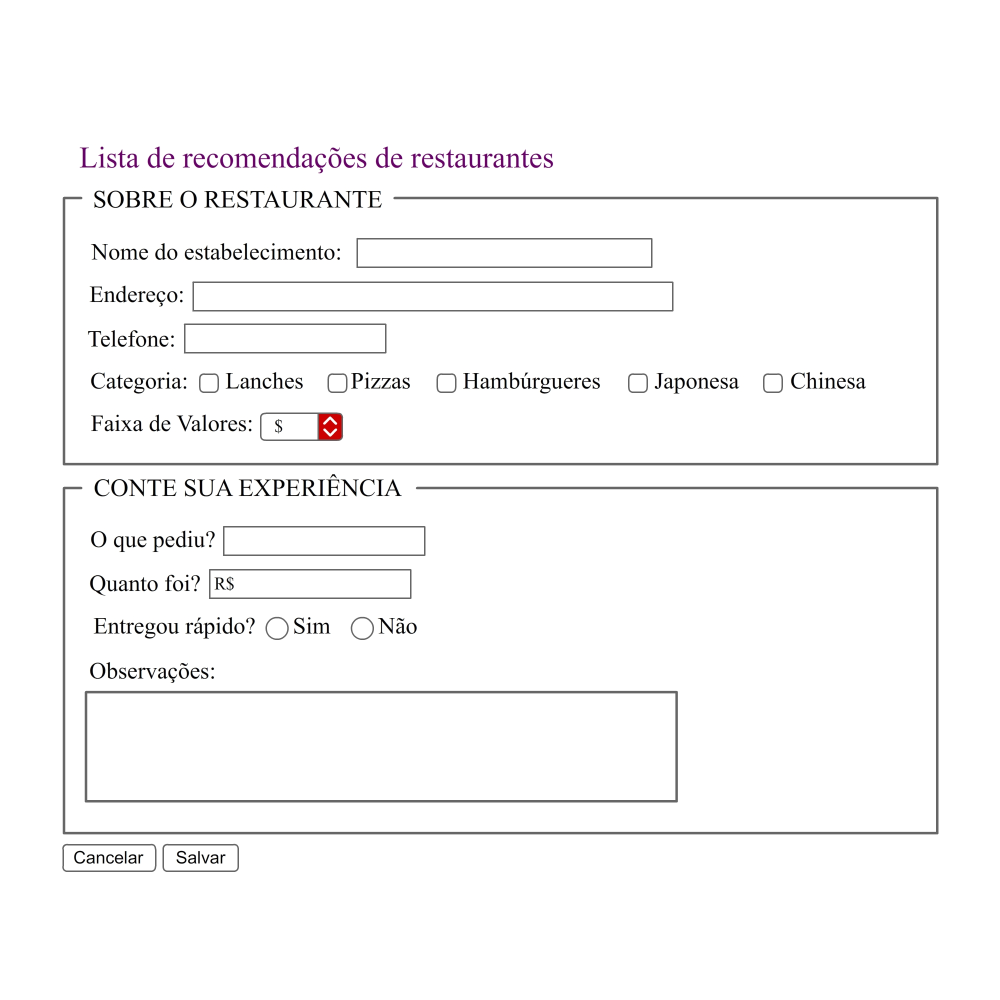

## 🚀 Atividade

Crie uma página com um formulário para cadastrar restaurantes e a sua experiência com o pedido.
Use a imagem em anexo como referência.

---

# 📚 O que eu aprendi com o projeto!

- Criar formulário;
- Trabalhar com diversos Input Types;
- Trabalhar com atributos do Input;
- Utilizar elementos de complemento em formulários;
    - fieldset;
    - legend;
    - label.
- Trabalhar com métodos HTTP para submissão de dados;
    - GET;
    - POST.
- Identificar eventos usando JavaScript;
    - onclick;
    - onblur;
    - onfocus;
    - ondblclick;
    - onmouseover;
    - onended.

# 💻 Tecnologias

<a href='https://www.w3schools.com/html/'>HTML5</a>
 
<a href='https://www.w3schools.com/css/'>CSS3</a>
 
<a href='https://code.visualstudio.com/'>Visual Studio Code</a>
 

# 📝 Sobre o projeto

- Curso HTML+CSS/Sass

Este é um projeto acadêmico. Seu principal objetivo é facilitar a avaliação dos professores.

---

O aprendizado é contínuo e o próximo nível nunca será o último 🚀 by [aalvs](https://app.rocketseat.com.br/me/aalvs).